#  Project 1: Standardized Testing, Statistical Summaries and Inference

## Problem Statement

<span style='color:green'> 
The new format for the SAT was released in March 2016. As an employee of the College Board - the organization that administers the SAT - we are a part of a team that tracks statewide participation and recommends where money is best spent to improve SAT participation rates.   

Based on 2017 and 2018 SAT data, there is a great disparity in SAT participation rates across states. College Board wants to improve SAT participation rates across US States. This project aims to investigate why certain states have low SAT participations rates and investigate whether there are any underlying trends or factors affecting a State’s SAT Participation Rate.


</span>

## Executive Summary

SAT and ACT provide 
> SAT and ACT scores are inversely correlated with their participation rates. 
> In 2017-18, 10 states (Colorado, Connecticut, Delaware, Idaho, Illinois, Maine, Michigan, New Hampshire, Rhode Island, West Virginia, District of Columbia) administered the SAT to public school students for free. These have resulted a great improvement of SAT take up rate in these states.
> Promoting SAT Test to US States that predominantly administer ACT Test with better access through SAT School Day Programs will be the key on promoting SAT in the country.


**HERE'S A DEMONSTRATION WITH THE CURRENT SECTION HEADERS**:

### Contents:
- [2017 Data Import & Cleaning](#Data-Import-and-Cleaning)
- [2018 Data Import and Cleaning](#2018-Data-Import-and-Cleaning)
- [Exploratory Data Analysis](#Exploratory-Data-Analysis)
- [Data Visualization](#Visualize-the-data)
- [Descriptive and Inferential Statistics](#Descriptive-and-Inferential-Statistics)
- [Outside Research](#Outside-Research)
- [Conclusions and Recommendations](#Conclusions-and-Recommendations)

**If you combine your problem statement, executive summary, data dictionary, and conclusions/recommendations, you have an amazing README.md file that quickly aligns your audience to the contents of your project.** Don't forget to cite your data sources!

<span style='color:green'> **IMPORT All relevant library** </span>
## 2017 Data Import and Cleaning

## 2017 Data Import & Cleaning

#### 3. Verbally Describe Data

<span style='color:green'>**Answer:** </span> <br/>
<span style='color:green'>- ACT contains state, participation rate, English, Math, Reading,Science and composite data <br/>- SAT contains state, participation rate, Evidence-Based Reading & Writing,	Math and Total data
</span>


#### 4a. Does the data look complete? 

<span style='color:green'> **Answer:** <br/> It contains the basic information for both ACT and SAT, although prelinary observation we might need more information to perform a more complete analysis</span>

#### 4b. Are there any obvious issues with the observations?

**What is the minimum *possible* value for each test/subtest? What is the maximum *possible* value?**

<span style='color:green'> **Answer:** </span> <br/>

<span style='color:green'> **ACT** </span> <br/>
- <span style='color:green'> ACT max score for each test/subtest is 32 marks </span>

<span style='color:green'> **SAT** </span> <br/>
- <span style='color:green'> SAT max score for each test/subtest is 800 marks </span>
- <span style='color:green'> SAT Total score is 1600 marks </span>

Consider comparing any questionable values to the sources of your data:
- [SAT](https://blog.collegevine.com/here-are-the-average-sat-scores-by-state/)
- [ACT](https://blog.prepscholar.com/act-scores-by-state-averages-highs-and-lows)

#### 8. Data dictionary

A data dictionary provides a quick overview of features/variables/columns, alongside data types and descriptions. 

Data Dictionary Entry:

|Variable|Type|Dataset|Description|
|---|---|---|---|
|**act17**|*dataframe*|ACT 2017 Results|Contain Means of 51 State ACT scores.| 
|**sat17**|*dataframe*|SAT 2017 Results|Contain Means of 51 State SAT scores.| 
|**final**|*dataframe*|Data from GA |2017 & 2018 ACT & SAT combined horizontally, with column name + _yr.|
|**final_v**|*dataframe*|Data from GA |2017 & 2018 ACT & SAT vertically horizontally.|
|**combined17**|*CSV file*|Data from GA |2017 ACT & SAT participation rate and its relevants scores.|
|**combined18**|*CSV file*|Data from GA |2018 ACT & SAT participation rate and its relevants scores.|
|**final**|*CSV file*|Data from GA |2017 & 2018 ACT & SAT combined horizontally.|

[Here's a quick link to a short guide for formatting markdown in Jupyter notebooks](https://jupyter-notebook.readthedocs.io/en/stable/examples/Notebook/Working%20With%20Markdown%20Cells.html).

## Exploratory Data Analysis


### Summary Statistics
Transpose the output of pandas `describe` method to create a quick overview of each numeric feature.


```python
round(final.describe(),2)
```


<div>
<style scoped>
    .dataframe tbody tr th:only-of-type {
        vertical-align: middle;
    }

    .dataframe tbody tr th {
        vertical-align: top;
    }

    .dataframe thead th {
        text-align: right;
    }
</style>
<table border="1" class="dataframe">
  <thead>
    <tr style="text-align: right;">
      <th></th>
      <th>act_part_17</th>
      <th>act_english_17</th>
      <th>act_math_17</th>
      <th>act_reading_17</th>
      <th>act_science_17</th>
      <th>act_composite_17</th>
      <th>sat_part_17</th>
      <th>sat_ebrw_17</th>
      <th>sat_math_17</th>
      <th>sat_total_17</th>
      <th>act_part_18</th>
      <th>act_composite_18</th>
      <th>act_english_18</th>
      <th>act_math_18</th>
      <th>act_reading_18</th>
      <th>act_science_18</th>
      <th>sat_part_18</th>
      <th>sat_ebrw_18</th>
      <th>sat_math_18</th>
      <th>sat_total_18</th>
    </tr>
  </thead>
  <tbody>
    <tr>
      <th>count</th>
      <td>51.00</td>
      <td>51.00</td>
      <td>51.00</td>
      <td>51.00</td>
      <td>51.00</td>
      <td>51.00</td>
      <td>51.00</td>
      <td>51.00</td>
      <td>51.00</td>
      <td>51.00</td>
      <td>51.00</td>
      <td>51.00</td>
      <td>51.00</td>
      <td>51.00</td>
      <td>51.00</td>
      <td>51.00</td>
      <td>51.00</td>
      <td>51.00</td>
      <td>51.00</td>
      <td>51.00</td>
    </tr>
    <tr>
      <th>mean</th>
      <td>65.25</td>
      <td>20.93</td>
      <td>21.18</td>
      <td>22.01</td>
      <td>21.04</td>
      <td>21.52</td>
      <td>39.80</td>
      <td>569.12</td>
      <td>547.63</td>
      <td>1126.10</td>
      <td>61.65</td>
      <td>21.49</td>
      <td>20.99</td>
      <td>21.13</td>
      <td>22.02</td>
      <td>21.35</td>
      <td>45.75</td>
      <td>563.69</td>
      <td>556.24</td>
      <td>1120.02</td>
    </tr>
    <tr>
      <th>std</th>
      <td>32.14</td>
      <td>2.35</td>
      <td>1.98</td>
      <td>2.07</td>
      <td>3.18</td>
      <td>2.02</td>
      <td>35.28</td>
      <td>45.67</td>
      <td>84.91</td>
      <td>92.49</td>
      <td>34.08</td>
      <td>2.11</td>
      <td>2.45</td>
      <td>2.04</td>
      <td>2.17</td>
      <td>1.87</td>
      <td>37.31</td>
      <td>47.50</td>
      <td>47.77</td>
      <td>94.16</td>
    </tr>
    <tr>
      <th>min</th>
      <td>8.00</td>
      <td>16.30</td>
      <td>18.00</td>
      <td>18.10</td>
      <td>2.30</td>
      <td>17.80</td>
      <td>2.00</td>
      <td>482.00</td>
      <td>52.00</td>
      <td>950.00</td>
      <td>7.00</td>
      <td>17.70</td>
      <td>16.60</td>
      <td>17.80</td>
      <td>18.00</td>
      <td>17.90</td>
      <td>2.00</td>
      <td>480.00</td>
      <td>480.00</td>
      <td>977.00</td>
    </tr>
    <tr>
      <th>25%</th>
      <td>31.00</td>
      <td>19.00</td>
      <td>19.40</td>
      <td>20.45</td>
      <td>19.90</td>
      <td>19.80</td>
      <td>4.00</td>
      <td>533.50</td>
      <td>522.00</td>
      <td>1055.50</td>
      <td>28.50</td>
      <td>19.95</td>
      <td>19.10</td>
      <td>19.40</td>
      <td>20.45</td>
      <td>19.85</td>
      <td>4.50</td>
      <td>534.50</td>
      <td>522.50</td>
      <td>1057.50</td>
    </tr>
    <tr>
      <th>50%</th>
      <td>69.00</td>
      <td>20.70</td>
      <td>20.90</td>
      <td>21.80</td>
      <td>21.30</td>
      <td>21.40</td>
      <td>38.00</td>
      <td>559.00</td>
      <td>548.00</td>
      <td>1107.00</td>
      <td>66.00</td>
      <td>21.30</td>
      <td>20.20</td>
      <td>20.70</td>
      <td>21.60</td>
      <td>21.10</td>
      <td>52.00</td>
      <td>552.00</td>
      <td>544.00</td>
      <td>1098.00</td>
    </tr>
    <tr>
      <th>75%</th>
      <td>100.00</td>
      <td>23.30</td>
      <td>23.10</td>
      <td>24.15</td>
      <td>22.75</td>
      <td>23.60</td>
      <td>66.00</td>
      <td>613.00</td>
      <td>599.00</td>
      <td>1212.00</td>
      <td>100.00</td>
      <td>23.55</td>
      <td>23.70</td>
      <td>23.15</td>
      <td>24.10</td>
      <td>23.05</td>
      <td>77.50</td>
      <td>610.50</td>
      <td>593.50</td>
      <td>1204.00</td>
    </tr>
    <tr>
      <th>max</th>
      <td>100.00</td>
      <td>25.50</td>
      <td>25.30</td>
      <td>26.00</td>
      <td>24.90</td>
      <td>25.50</td>
      <td>100.00</td>
      <td>644.00</td>
      <td>651.00</td>
      <td>1295.00</td>
      <td>100.00</td>
      <td>25.60</td>
      <td>26.00</td>
      <td>25.20</td>
      <td>26.10</td>
      <td>24.90</td>
      <td>100.00</td>
      <td>643.00</td>
      <td>655.00</td>
      <td>1298.00</td>
    </tr>
  </tbody>
</table>
</div>


#### Manually calculate standard deviation

$$\sigma = \sqrt{\frac{1}{n}\sum_{i=1}^n(x_i - \mu)^2}$$

- Write a function to calculate standard deviation using the formula above


```python
act17_rn['act_math'].sum()
```


    1080.3


```python
def MStd_dev(data):
    result = math.sqrt((sum((data-data.mean())**2))/len(data))
    return result
```


```python
TList = act17_rn['act_english']
MStd_dev(TList)
```


    2.3304876369363363


```python
np.std(TList)
```


    2.3304876369363363


```python
columns_name = act17_rn.keys()
columns_name
```


    Index(['act_part', 'act_english', 'act_math', 'act_reading', 'act_science',
           'act_composite'],
          dtype='object')


```python
Lists = [act17_rn[col] for col in columns_name]
type(Lists)
```


    list


```python
List_Std = [round(MStd_dev(List),2) for List in Lists]
List_Std
```


    [31.82, 2.33, 1.96, 2.05, 3.15, 2.0]


```python
List_Std2 = [round(np.std(List),2) for List in Lists]
List_Std2 
```


    [31.82, 2.33, 1.96, 2.05, 3.15, 2.0]


```python
act17_rn[columns_name].describe()
```


<div>
<style scoped>
    .dataframe tbody tr th:only-of-type {
        vertical-align: middle;
    }

    .dataframe tbody tr th {
        vertical-align: top;
    }

    .dataframe thead th {
        text-align: right;
    }
</style>
<table border="1" class="dataframe">
  <thead>
    <tr style="text-align: right;">
      <th></th>
      <th>act_part</th>
      <th>act_english</th>
      <th>act_math</th>
      <th>act_reading</th>
      <th>act_science</th>
      <th>act_composite</th>
    </tr>
  </thead>
  <tbody>
    <tr>
      <th>count</th>
      <td>51.000000</td>
      <td>51.000000</td>
      <td>51.000000</td>
      <td>51.000000</td>
      <td>51.000000</td>
      <td>51.000000</td>
    </tr>
    <tr>
      <th>mean</th>
      <td>65.254902</td>
      <td>20.931373</td>
      <td>21.182353</td>
      <td>22.013725</td>
      <td>21.041176</td>
      <td>21.519608</td>
    </tr>
    <tr>
      <th>std</th>
      <td>32.140842</td>
      <td>2.353677</td>
      <td>1.981989</td>
      <td>2.067271</td>
      <td>3.182463</td>
      <td>2.020695</td>
    </tr>
    <tr>
      <th>min</th>
      <td>8.000000</td>
      <td>16.300000</td>
      <td>18.000000</td>
      <td>18.100000</td>
      <td>2.300000</td>
      <td>17.800000</td>
    </tr>
    <tr>
      <th>25%</th>
      <td>31.000000</td>
      <td>19.000000</td>
      <td>19.400000</td>
      <td>20.450000</td>
      <td>19.900000</td>
      <td>19.800000</td>
    </tr>
    <tr>
      <th>50%</th>
      <td>69.000000</td>
      <td>20.700000</td>
      <td>20.900000</td>
      <td>21.800000</td>
      <td>21.300000</td>
      <td>21.400000</td>
    </tr>
    <tr>
      <th>75%</th>
      <td>100.000000</td>
      <td>23.300000</td>
      <td>23.100000</td>
      <td>24.150000</td>
      <td>22.750000</td>
      <td>23.600000</td>
    </tr>
    <tr>
      <th>max</th>
      <td>100.000000</td>
      <td>25.500000</td>
      <td>25.300000</td>
      <td>26.000000</td>
      <td>24.900000</td>
      <td>25.500000</td>
    </tr>
  </tbody>
</table>
</div>


- Use a **dictionary comprehension** to apply your standard deviation function to each numeric column in the dataframe.  **No loops**  
- Assign the output to variable `sd` as a dictionary where: 
    - Each column name is now a key 
    - That standard deviation of the column is the value 
     
*Example Output :* `{'ACT_Math': 120, 'ACT_Reading': 120, ...}`


```python
std_dict = {col: std for col,std in zip(columns_name, List_Std)}
std_dict
```


    {'act_part': 31.82,
     'act_english': 2.33,
     'act_math': 1.96,
     'act_reading': 2.05,
     'act_science': 3.15,
     'act_composite': 2.0}


Do your manually calculated standard deviations match up with the output from pandas `describe`? What about numpy's `std` method?

<span style='color:green'> **Answer**</span>

<span style='color:green'> From the above, the calculated std and numpy's std is different from the pandas describe. This is mainly Pandas uses the unbiased estimator (N-1 in the denominator), whereas Numpy by default does not. </span>


#### Investigate trends in the data
Using sorting and/or masking (along with the `.head` method to not print our entire dataframe), consider the following questions:

- Which states have the highest and lowest participation rates for the:
    - 2017 SAT?
    - 2018 SAT?
    - 2017 ACT?
    - 2018 ACT?
- Which states have the highest and lowest mean total/composite scores for the:
    - 2017 SAT?
    - 2018 SAT?
    - 2017 ACT?
    - 2018 ACT?
- Do any states with 100% participation on a given test have a rate change year-to-year?
- Do any states show have >50% participation on *both* tests either year?

Based on what you've just observed, have you identified any states that you're especially interested in? **Make a note of these and state *why* you think they're interesting**.

**You should comment on your findings at each step in a markdown cell below your code block**. Make sure you include at least one example of sorting your dataframe by a column, and one example of using boolean filtering (i.e., masking) to select a subset of the dataframe.


```python
Final_Transpose = final.transpose()
round(Final_Transpose.describe(),2)
```


<div>
<style scoped>
    .dataframe tbody tr th:only-of-type {
        vertical-align: middle;
    }

    .dataframe tbody tr th {
        vertical-align: top;
    }

    .dataframe thead th {
        text-align: right;
    }
</style>
<table border="1" class="dataframe">
  <thead>
    <tr style="text-align: right;">
      <th>state</th>
      <th>Alabama</th>
      <th>Alaska</th>
      <th>Arizona</th>
      <th>Arkansas</th>
      <th>California</th>
      <th>Colorado</th>
      <th>Connecticut</th>
      <th>Delaware</th>
      <th>District of Columbia</th>
      <th>Florida</th>
      <th>...</th>
      <th>South Dakota</th>
      <th>Tennessee</th>
      <th>Texas</th>
      <th>Utah</th>
      <th>Vermont</th>
      <th>Virginia</th>
      <th>Washington</th>
      <th>West Virginia</th>
      <th>Wisconsin</th>
      <th>Wyoming</th>
    </tr>
  </thead>
  <tbody>
    <tr>
      <th>count</th>
      <td>20.00</td>
      <td>20.00</td>
      <td>20.00</td>
      <td>20.00</td>
      <td>20.00</td>
      <td>20.00</td>
      <td>20.00</td>
      <td>20.00</td>
      <td>20.00</td>
      <td>20.00</td>
      <td>...</td>
      <td>20.00</td>
      <td>20.00</td>
      <td>20.00</td>
      <td>20.00</td>
      <td>20.00</td>
      <td>20.00</td>
      <td>20.00</td>
      <td>20.00</td>
      <td>20.00</td>
      <td>20.00</td>
    </tr>
    <tr>
      <th>mean</th>
      <td>253.18</td>
      <td>237.66</td>
      <td>245.52</td>
      <td>257.70</td>
      <td>232.96</td>
      <td>245.76</td>
      <td>234.99</td>
      <td>222.94</td>
      <td>217.40</td>
      <td>235.38</td>
      <td>...</td>
      <td>264.56</td>
      <td>266.21</td>
      <td>226.18</td>
      <td>245.28</td>
      <td>244.04</td>
      <td>243.09</td>
      <td>235.86</td>
      <td>227.44</td>
      <td>279.00</td>
      <td>269.07</td>
    </tr>
    <tr>
      <th>std</th>
      <td>385.08</td>
      <td>360.40</td>
      <td>373.93</td>
      <td>392.93</td>
      <td>350.49</td>
      <td>366.90</td>
      <td>341.41</td>
      <td>325.44</td>
      <td>313.45</td>
      <td>346.33</td>
      <td>...</td>
      <td>406.55</td>
      <td>406.57</td>
      <td>336.48</td>
      <td>373.56</td>
      <td>367.40</td>
      <td>364.73</td>
      <td>354.58</td>
      <td>343.85</td>
      <td>427.91</td>
      <td>411.48</td>
    </tr>
    <tr>
      <th>min</th>
      <td>5.00</td>
      <td>18.70</td>
      <td>18.20</td>
      <td>3.00</td>
      <td>22.10</td>
      <td>11.00</td>
      <td>24.60</td>
      <td>17.00</td>
      <td>22.70</td>
      <td>19.00</td>
      <td>...</td>
      <td>3.00</td>
      <td>5.00</td>
      <td>19.50</td>
      <td>3.00</td>
      <td>23.10</td>
      <td>23.30</td>
      <td>20.90</td>
      <td>14.00</td>
      <td>3.00</td>
      <td>3.00</td>
    </tr>
    <tr>
      <th>25%</th>
      <td>18.90</td>
      <td>20.27</td>
      <td>19.48</td>
      <td>19.08</td>
      <td>22.65</td>
      <td>21.12</td>
      <td>25.42</td>
      <td>23.40</td>
      <td>23.67</td>
      <td>19.48</td>
      <td>...</td>
      <td>21.58</td>
      <td>19.48</td>
      <td>20.70</td>
      <td>19.90</td>
      <td>23.75</td>
      <td>23.72</td>
      <td>22.00</td>
      <td>20.23</td>
      <td>20.38</td>
      <td>19.78</td>
    </tr>
    <tr>
      <th>50%</th>
      <td>19.50</td>
      <td>27.30</td>
      <td>24.55</td>
      <td>19.60</td>
      <td>25.05</td>
      <td>24.15</td>
      <td>26.05</td>
      <td>24.30</td>
      <td>28.45</td>
      <td>38.55</td>
      <td>...</td>
      <td>22.25</td>
      <td>19.90</td>
      <td>31.05</td>
      <td>20.70</td>
      <td>24.65</td>
      <td>24.65</td>
      <td>23.35</td>
      <td>21.25</td>
      <td>20.70</td>
      <td>20.60</td>
    </tr>
    <tr>
      <th>75%</th>
      <td>571.25</td>
      <td>535.75</td>
      <td>555.50</td>
      <td>580.00</td>
      <td>525.75</td>
      <td>509.25</td>
      <td>513.75</td>
      <td>492.00</td>
      <td>471.00</td>
      <td>502.75</td>
      <td>...</td>
      <td>605.25</td>
      <td>604.75</td>
      <td>508.25</td>
      <td>492.50</td>
      <td>551.75</td>
      <td>543.25</td>
      <td>535.00</td>
      <td>492.75</td>
      <td>641.25</td>
      <td>609.25</td>
    </tr>
    <tr>
      <th>max</th>
      <td>1166.00</td>
      <td>1106.00</td>
      <td>1149.00</td>
      <td>1208.00</td>
      <td>1076.00</td>
      <td>1201.00</td>
      <td>1053.00</td>
      <td>998.00</td>
      <td>977.00</td>
      <td>1099.00</td>
      <td>...</td>
      <td>1240.00</td>
      <td>1231.00</td>
      <td>1032.00</td>
      <td>1238.00</td>
      <td>1120.00</td>
      <td>1117.00</td>
      <td>1081.00</td>
      <td>1086.00</td>
      <td>1294.00</td>
      <td>1257.00</td>
    </tr>
  </tbody>
</table>
<p>8 rows × 51 columns</p>
</div>


```python
print("SAT2017 - The lowest Participation State is",Final_Transpose.loc['sat_part_17'].idxmin(axis=1),)
print("SAT2017 - The highest Participation State is",Final_Transpose.loc['sat_part_17'].idxmax(axis=1))
print("SAT2018 - The lowest Participation State is",Final_Transpose.loc['sat_part_18'].idxmin(axis=1))
print("SAT2018 - The highest Participation State is",Final_Transpose.loc['sat_part_18'].idxmax(axis=1))
print("ACT2017 - The lowest Participation State is",Final_Transpose.loc['act_part_17'].idxmin(axis=1))
print("ACT2017 - The highest Participation State is",Final_Transpose.loc['act_part_17'].idxmax(axis=1))
print("ACT2018 - The lowest Participation State is",Final_Transpose.loc['act_part_18'].idxmin(axis=1))
print("ACT2018 - The highest Participation State is",Final_Transpose.loc['act_part_18'].idxmax(axis=1))
```

    SAT2017 - The lowest Participation State is Iowa
    SAT2017 - The highest Participation State is Connecticut
    SAT2018 - The lowest Participation State is North Dakota
    SAT2018 - The highest Participation State is Colorado
    ACT2017 - The lowest Participation State is Maine
    ACT2017 - The highest Participation State is Alabama
    ACT2018 - The lowest Participation State is Maine
    ACT2018 - The highest Participation State is Alabama


```python
print("SAT2017 - The lowest Total Score State is",Final_Transpose.loc['sat_total_18'].idxmin(axis=1),)
print("SAT2017 - The highest Total Score State is",Final_Transpose.loc['sat_total_17'].idxmax(axis=1))
print("SAT2018 - The lowest Total Score State is",Final_Transpose.loc['sat_total_18'].idxmin(axis=1))
print("SAT2018 - The highest Total Score State is",Final_Transpose.loc['sat_total_18'].idxmax(axis=1))
print("ACT2017 - The lowest Composite Score State is",Final_Transpose.loc['act_composite_17'].idxmin(axis=1))
print("ACT2017 - The highest Composite Score State is",Final_Transpose.loc['act_composite_17'].idxmax(axis=1))
print("ACT2018 - The lowest Composite Score State is",Final_Transpose.loc['act_composite_17'].idxmin(axis=1))
print("ACT2018 - The highest Composite Score State is",Final_Transpose.loc['act_composite_17'].idxmax(axis=1))
```

    SAT2017 - The lowest Total Score State is District of Columbia
    SAT2017 - The highest Total Score State is Minnesota
    SAT2018 - The lowest Total Score State is District of Columbia
    SAT2018 - The highest Total Score State is Minnesota
    ACT2017 - The lowest Composite Score State is Nevada
    ACT2017 - The highest Composite Score State is New Hampshire
    ACT2018 - The lowest Composite Score State is Nevada
    ACT2018 - The highest Composite Score State is New Hampshire


## Visualize the data

There's not a magic bullet recommendation for the right number of plots to understand a given dataset, but visualizing your data is *always* a good idea. Not only does it allow you to quickly convey your findings (even if you have a non-technical audience), it will often reveal trends in your data that escaped you when you were looking only at numbers.

Some recommendations on plotting:
- Plots have titles
- Plots have axis labels
- Plots have appropriate tick labels
- All text is legible in a plot
- Plots demonstrate meaningful and valid relationships
- Plots are interpreted to aid understanding

There is such a thing as too many plots, and there are a *lot* of bad plots. You might make some! (But hopefully not with the guided prompts below).

#### Use Seaborn's heatmap with pandas `.corr()` to visualize correlations between all numeric features

Heatmaps are generally not appropriate for presentations, and should often be excluded from reports as they can be visually overwhelming. **However**, they can be extremely useful in identify relationships of potential interest (as well as identifying potential collinearity before modeling).

*example*:
```python
sns.heatmap(df.corr())
```

Please take time to format your output, adding a title. Look through some of the additional arguments and options. (Axis labels aren't really necessary, as long as the title is informative).


```python
mask = np.zeros_like(final.corr())
triangle_indices = np.triu_indices_from(mask)
mask[triangle_indices] = True
mask
plt.figure(figsize=(16,10))
sns.heatmap(final.corr(),mask=mask, annot=True, annot_kws={'size': 12})
plt.xticks(fontsize=14)
plt.yticks(fontsize=14)
plt.show()
```


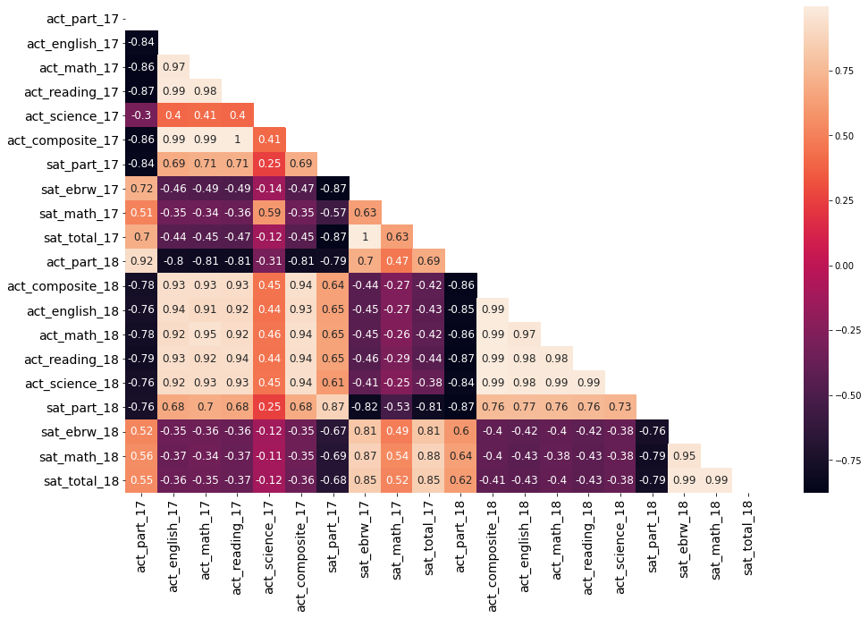


```python
mask = np.zeros_like(final_v.corr())
triangle_indices = np.triu_indices_from(mask)
mask[triangle_indices] = True
mask
plt.figure(figsize=(16,10))
sns.heatmap(final_v.corr(),mask=mask, annot=True, annot_kws={'size': 10})
plt.xticks(fontsize=8)
plt.yticks(fontsize=8)
plt.show()
```


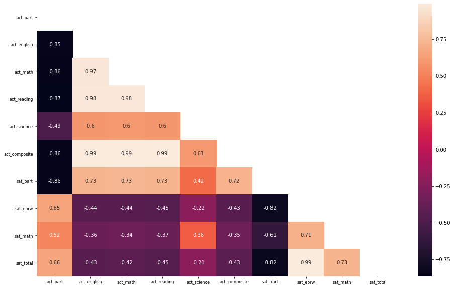


#### Define a custom function to subplot histograms

We have data for two tests for two years. We only have composite (and not subtest scores) for the 2018 ACT. We should write a function that will take the names of 2+ columns and subplot histograms. While you can use pandas plotting or Seaborn here, matplotlib gives you greater control over all aspects of your plots.

[Helpful Link for Plotting Multiple Figures](https://matplotlib.org/users/pyplot_tutorial.html#working-with-multiple-figures-and-axes)

Here's some starter code:


```python
def subplot_histograms(dataframe, list_of_columns, list_of_titles, list_of_xlabels):
    nrows = int(np.ceil(len(list_of_columns)/2)) # Makes sure you have enough rows
    fig, ax = plt.subplots(nrows=nrows, ncols=2,figsize=(28,28)) # You'll want to specify your figsize
    ax = ax.ravel() # Ravel turns a matrix into a vector, which is easier to iterate
    for i, column in enumerate(list_of_columns): # Gives us an index value to get into all our lists
        MR = dataframe[column].median()
        color1 = '#ff7733'
        color2 = '#9fff33'
        ax[i].hist(dataframe[column],bins=20,color="g",edgecolor="black") # feel free to add morae settings
        ax[i].set_title(list_of_titles[i])
        ax[i].set_xlabel(list_of_xlabels[i])
        ax[i].axvline(MR, linestyle='--', lw = 2, color=color1, label=MR)
        # Set titles, labels, etc here for each subplot
```

#### Plot and interpret histograms 
For each of the following:
- Participation rates for SAT & ACT
- Math scores for SAT & ACT
- Reading/verbal scores for SAT & ACT

#### <span style='color:green'> Histograms - Math Score for SAT & ACT </span>


```python
Titles = ['ACT 17/18 Participation Histogram','SAT 17/18 Participation Histogram',
          'ACT 17/18 Math Histogram','SAT 17/18 Math Histogram',
         'ACT 17/18 Reading Histogram','SAT 17/18 EBRW Histogram']
XLabels = ('ACT Participant %','SAT Paticipant %','ACT Math','SAT Math','ACT Reading','SAT EBRW')
subplot_histograms(final_v, ['act_part','sat_part','act_math','sat_math','act_reading','sat_ebrw'],Titles,XLabels)
```


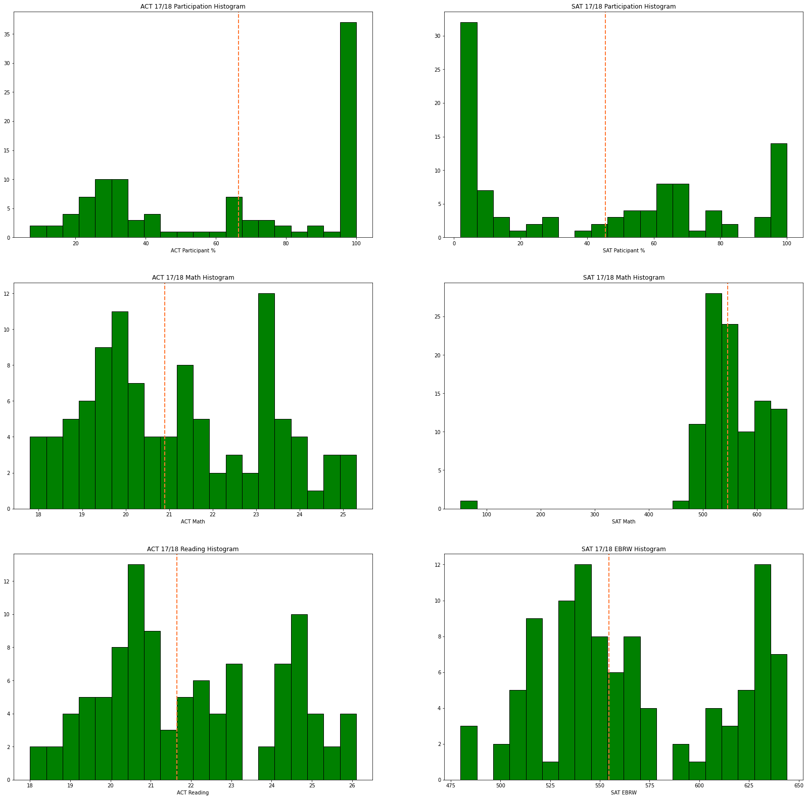


#### Plot and interpret scatter plots

For each of the following:
- SAT vs. ACT math scores for 2017
- SAT vs. ACT verbal/reading scores for 2017
- SAT vs. ACT total/composite scores for 2017
- Total scores for SAT 2017 vs. 2018
- Composite scores for ACT 2017 vs. 2018

Plot the two variables against each other using matplotlib or Seaborn

Your plots should show:
- Two clearly labeled axes
- A proper title
- Using colors and symbols that are clear and unmistakable

**Feel free to write a custom function, and subplot if you'd like.** Functions save both time and space.


```python
#Defines a function to create a scatterplot between two variables
def subplot_scatterplot(df, column1, column2, xlabel,ylabel,title):
    f = plt.figure(figsize=(8,5))
    sns.set_style('whitegrid')
    # sns.scatterplot(x=final_sat_act[column1],y=final_sat_act[column2])
    sns.scatterplot(x=df[column1],y=df[column2])
    # sns.lmplot(column1,column2, data=df)
    # sns.scatterplot(column1,column2)
    plt.xlabel(xlabel)
    plt.ylabel(ylabel)
    plt.title(title);
```


```python
# SAT vs. ACT math scores for 2017
subplot_scatterplot(final, 'sat_math_17','act_math_17', 
                    'SAT Math 17', 'ACT Math 17', 
                    'SAT vs. ACT math scores for 2017')
```


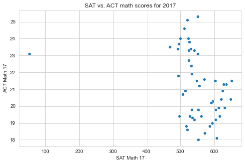


```python
# SAT vs. ACT verbal/reading scores for 2017
subplot_scatterplot(final, 'sat_ebrw_17','act_reading_17', 
                    'SAT Evidence-Based Reading and Writing 17', 'ACT Reading 17', 
                    'SAT vs. ACT verbal/reading scores for 2017')
```


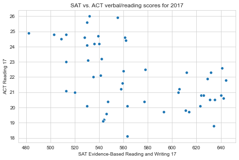


```python
# SAT vs. ACT total/composite scores for 2017
subplot_scatterplot(final, 'sat_total_17','act_composite_17', 
                    'SAT Total Scores 17', 'ACT Composite Scores 17', 
                    'SAT vs. ACT total/composite scores for 2017')
```


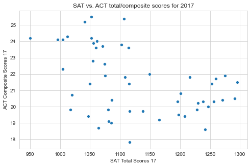


```python
def subplot_lmplot(df, column1, column2, xlabel,ylabel,title):
    f = plt.figure(figsize=(8,5))
    sns.set_style('whitegrid')
    sns.lmplot(column1,column2, data=df)
    plt.xlabel(xlabel)
    plt.ylabel(ylabel)
    plt.title(title);
```


```python
# Total scores for SAT 2017 vs. 2018
subplot_lmplot(final, 'sat_total_17','sat_total_18', 
                    'SAT Total Scores 17', 'SAT Total Scores 18', 
                    'Total scores for SAT 2017 vs. 2018')
```


    <Figure size 576x360 with 0 Axes>


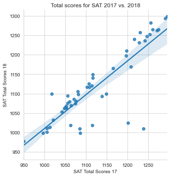


```python
# Composite scores for ACT 2017 vs. 2018
subplot_lmplot(final, 'act_composite_17','act_composite_18', 
                    'ACT Composite Scores 17', 'ACT Composite Scores 18', 
                    'Composite scores for ACT 2017 vs. 2018')
```


    <Figure size 576x360 with 0 Axes>


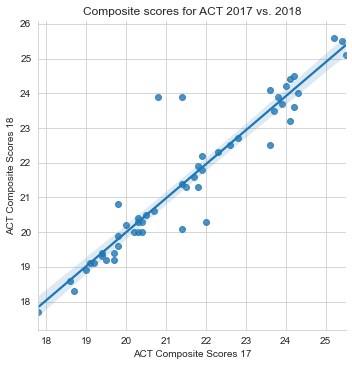


#### Plot and interpret boxplots

For each numeric variable in the dataframe create a boxplot using Seaborn. Boxplots demonstrate central tendency and spread in variables. In a certain sense, these are somewhat redundant with histograms, but you may be better able to identify clear outliers or differences in IQR, etc.

Multiple values can be plotted to a single boxplot as long as they are of the same relative scale (meaning they have similar min/max values).

Each boxplot should:
- Only include variables of a similar scale
- Have clear labels for each variable
- Have appropriate titles and labels


```python
final_v.head()
```


<div>
<style scoped>
    .dataframe tbody tr th:only-of-type {
        vertical-align: middle;
    }

    .dataframe tbody tr th {
        vertical-align: top;
    }

    .dataframe thead th {
        text-align: right;
    }
</style>
<table border="1" class="dataframe">
  <thead>
    <tr style="text-align: right;">
      <th></th>
      <th>act_part</th>
      <th>act_english</th>
      <th>act_math</th>
      <th>act_reading</th>
      <th>act_science</th>
      <th>act_composite</th>
      <th>sat_part</th>
      <th>sat_ebrw</th>
      <th>sat_math</th>
      <th>sat_total</th>
    </tr>
    <tr>
      <th>state</th>
      <th></th>
      <th></th>
      <th></th>
      <th></th>
      <th></th>
      <th></th>
      <th></th>
      <th></th>
      <th></th>
      <th></th>
    </tr>
  </thead>
  <tbody>
    <tr>
      <th>Alabama</th>
      <td>100.0</td>
      <td>18.9</td>
      <td>18.4</td>
      <td>19.7</td>
      <td>19.4</td>
      <td>19.2</td>
      <td>5.0</td>
      <td>593.0</td>
      <td>572.0</td>
      <td>1165.0</td>
    </tr>
    <tr>
      <th>Alaska</th>
      <td>65.0</td>
      <td>18.7</td>
      <td>19.8</td>
      <td>20.4</td>
      <td>19.9</td>
      <td>19.8</td>
      <td>38.0</td>
      <td>547.0</td>
      <td>533.0</td>
      <td>1080.0</td>
    </tr>
    <tr>
      <th>Arizona</th>
      <td>62.0</td>
      <td>18.6</td>
      <td>19.8</td>
      <td>20.1</td>
      <td>19.8</td>
      <td>19.7</td>
      <td>30.0</td>
      <td>563.0</td>
      <td>553.0</td>
      <td>1116.0</td>
    </tr>
    <tr>
      <th>Arkansas</th>
      <td>100.0</td>
      <td>18.9</td>
      <td>19.0</td>
      <td>19.7</td>
      <td>19.5</td>
      <td>19.4</td>
      <td>3.0</td>
      <td>614.0</td>
      <td>594.0</td>
      <td>1208.0</td>
    </tr>
    <tr>
      <th>California</th>
      <td>31.0</td>
      <td>22.5</td>
      <td>22.7</td>
      <td>23.1</td>
      <td>22.2</td>
      <td>22.8</td>
      <td>53.0</td>
      <td>531.0</td>
      <td>524.0</td>
      <td>1055.0</td>
    </tr>
  </tbody>
</table>
</div>


```python
TList = list(final_v['act_english'])
DF1 = pd.DataFrame(TList, columns=['mark'])
DF1["Subject"] = "ACT_english"
TList = list(final_v['act_math'])
DF2 = pd.DataFrame(TList, columns=['mark'])
DF2["Subject"] = "ACT_math"
TList = list(final_v['act_reading'])
DF3 = pd.DataFrame(TList, columns=['mark'])
DF3["Subject"] = "ACT_reading"
TList = list(final_v['act_science'])
DF4 = pd.DataFrame(TList, columns=['mark'])
DF4["Subject"] = "ACT_science"
TList = list(final_v['act_composite'])
DF5 = pd.DataFrame(TList, columns=['mark'])
DF5["Subject"] = "ACT_composite"
Marks_ACT = pd.concat(objs = [DF1,DF2,DF3,DF4,DF5])
Marks_ACT
```


<div>
<style scoped>
    .dataframe tbody tr th:only-of-type {
        vertical-align: middle;
    }

    .dataframe tbody tr th {
        vertical-align: top;
    }

    .dataframe thead th {
        text-align: right;
    }
</style>
<table border="1" class="dataframe">
  <thead>
    <tr style="text-align: right;">
      <th></th>
      <th>mark</th>
      <th>Subject</th>
    </tr>
  </thead>
  <tbody>
    <tr>
      <th>0</th>
      <td>18.9</td>
      <td>ACT_english</td>
    </tr>
    <tr>
      <th>1</th>
      <td>18.7</td>
      <td>ACT_english</td>
    </tr>
    <tr>
      <th>2</th>
      <td>18.6</td>
      <td>ACT_english</td>
    </tr>
    <tr>
      <th>3</th>
      <td>18.9</td>
      <td>ACT_english</td>
    </tr>
    <tr>
      <th>4</th>
      <td>22.5</td>
      <td>ACT_english</td>
    </tr>
    <tr>
      <th>...</th>
      <td>...</td>
      <td>...</td>
    </tr>
    <tr>
      <th>97</th>
      <td>23.9</td>
      <td>ACT_composite</td>
    </tr>
    <tr>
      <th>98</th>
      <td>22.2</td>
      <td>ACT_composite</td>
    </tr>
    <tr>
      <th>99</th>
      <td>20.3</td>
      <td>ACT_composite</td>
    </tr>
    <tr>
      <th>100</th>
      <td>20.5</td>
      <td>ACT_composite</td>
    </tr>
    <tr>
      <th>101</th>
      <td>20.0</td>
      <td>ACT_composite</td>
    </tr>
  </tbody>
</table>
<p>510 rows × 2 columns</p>
</div>


```python
final_v.head(2)
```


<div>
<style scoped>
    .dataframe tbody tr th:only-of-type {
        vertical-align: middle;
    }

    .dataframe tbody tr th {
        vertical-align: top;
    }

    .dataframe thead th {
        text-align: right;
    }
</style>
<table border="1" class="dataframe">
  <thead>
    <tr style="text-align: right;">
      <th></th>
      <th>act_part</th>
      <th>act_english</th>
      <th>act_math</th>
      <th>act_reading</th>
      <th>act_science</th>
      <th>act_composite</th>
      <th>sat_part</th>
      <th>sat_ebrw</th>
      <th>sat_math</th>
      <th>sat_total</th>
    </tr>
    <tr>
      <th>state</th>
      <th></th>
      <th></th>
      <th></th>
      <th></th>
      <th></th>
      <th></th>
      <th></th>
      <th></th>
      <th></th>
      <th></th>
    </tr>
  </thead>
  <tbody>
    <tr>
      <th>Alabama</th>
      <td>100.0</td>
      <td>18.9</td>
      <td>18.4</td>
      <td>19.7</td>
      <td>19.4</td>
      <td>19.2</td>
      <td>5.0</td>
      <td>593.0</td>
      <td>572.0</td>
      <td>1165.0</td>
    </tr>
    <tr>
      <th>Alaska</th>
      <td>65.0</td>
      <td>18.7</td>
      <td>19.8</td>
      <td>20.4</td>
      <td>19.9</td>
      <td>19.8</td>
      <td>38.0</td>
      <td>547.0</td>
      <td>533.0</td>
      <td>1080.0</td>
    </tr>
  </tbody>
</table>
</div>


```python
TList = list(final_v['sat_ebrw'])
DF_A1 = pd.DataFrame(TList, columns=['mark'])
DF_A1["Subject"] = "SAT_ebrw"

TList = list(final_v['sat_math'])
DF_A2 = pd.DataFrame(TList, columns=['mark'])
DF_A2["Subject"] = "SAT_math"

TList = list(final_v['sat_total'])
DF_A3 = pd.DataFrame(TList, columns=['mark'])
DF_A3["Subject"] = "SAT_total"

Marks_SAT = pd.concat(objs = [DF_A1,DF_A2,DF_A3])
Marks_SAT
```


<div>
<style scoped>
    .dataframe tbody tr th:only-of-type {
        vertical-align: middle;
    }

    .dataframe tbody tr th {
        vertical-align: top;
    }

    .dataframe thead th {
        text-align: right;
    }
</style>
<table border="1" class="dataframe">
  <thead>
    <tr style="text-align: right;">
      <th></th>
      <th>mark</th>
      <th>Subject</th>
    </tr>
  </thead>
  <tbody>
    <tr>
      <th>0</th>
      <td>593.0</td>
      <td>SAT_ebrw</td>
    </tr>
    <tr>
      <th>1</th>
      <td>547.0</td>
      <td>SAT_ebrw</td>
    </tr>
    <tr>
      <th>2</th>
      <td>563.0</td>
      <td>SAT_ebrw</td>
    </tr>
    <tr>
      <th>3</th>
      <td>614.0</td>
      <td>SAT_ebrw</td>
    </tr>
    <tr>
      <th>4</th>
      <td>531.0</td>
      <td>SAT_ebrw</td>
    </tr>
    <tr>
      <th>...</th>
      <td>...</td>
      <td>...</td>
    </tr>
    <tr>
      <th>97</th>
      <td>1117.0</td>
      <td>SAT_total</td>
    </tr>
    <tr>
      <th>98</th>
      <td>1081.0</td>
      <td>SAT_total</td>
    </tr>
    <tr>
      <th>99</th>
      <td>999.0</td>
      <td>SAT_total</td>
    </tr>
    <tr>
      <th>100</th>
      <td>1294.0</td>
      <td>SAT_total</td>
    </tr>
    <tr>
      <th>101</th>
      <td>1257.0</td>
      <td>SAT_total</td>
    </tr>
  </tbody>
</table>
<p>306 rows × 2 columns</p>
</div>


```python
sns.set(style="whitegrid")
palette="Set3"
plt.xticks(rotation=45)
# ax = sns.boxplot(x='Subject', y='mark', data = Marks_ACT, linewidth=1,hue="Subject")
ax = sns.boxplot(x='Subject', y='mark', data = Marks_ACT, linewidth=1)
# ax = sns.swarmplot(x="Subject", y="mark", data= Marks, color=".25")

```


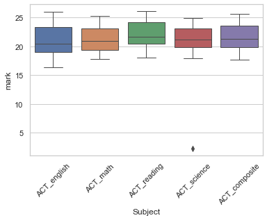


```python
sns.set(style="whitegrid")
palette="Set3"
plt.xticks(rotation=45)
ax = sns.boxplot(x='Subject', y='mark', data = Marks_ACT, linewidth=1,hue="Subject")
ax = sns.swarmplot(x="Subject", y="mark", data= Marks_ACT, color=".25")
```


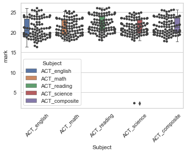


```python
sns.set(style="whitegrid")
palette="Set3"
plt.xticks(rotation=45)
# ax = sns.boxplot(x='Subject', y='mark', data = Marks_ACT, linewidth=1,hue="Subject")
ax = sns.boxplot(x='Subject', y='mark', data = Marks_SAT, linewidth=1)
# ax = sns.swarmplot(x="Subject", y="mark", data= Marks, color=".25")

```


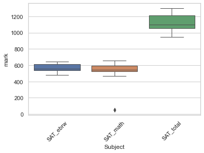


```python
sns.set(style="whitegrid")
palette="Set3"
plt.xticks(rotation=45)
ax = sns.boxplot(x='Subject', y='mark', data = Marks_SAT, linewidth=1,hue="Subject")
ax = sns.swarmplot(x="Subject", y="mark", data= Marks_SAT, color=".25")
```


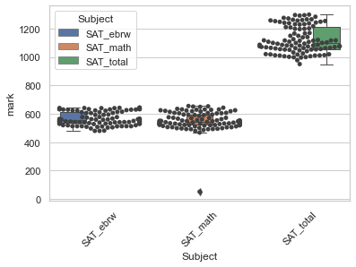


#### Feel free to do additional plots below
*(do research and choose your own chart types & variables)*

Are there any additional trends or relationships you haven't explored? Was there something interesting you saw that you'd like to dive further into? It's likely that there are a few more plots you might want to generate to support your narrative and recommendations that you are building toward. **As always, make sure you're interpreting your plots as you go**.


```python
final_v.head(1)
```


<div>
<style scoped>
    .dataframe tbody tr th:only-of-type {
        vertical-align: middle;
    }

    .dataframe tbody tr th {
        vertical-align: top;
    }

    .dataframe thead th {
        text-align: right;
    }
</style>
<table border="1" class="dataframe">
  <thead>
    <tr style="text-align: right;">
      <th></th>
      <th>act_part</th>
      <th>act_english</th>
      <th>act_math</th>
      <th>act_reading</th>
      <th>act_science</th>
      <th>act_composite</th>
      <th>sat_part</th>
      <th>sat_ebrw</th>
      <th>sat_math</th>
      <th>sat_total</th>
    </tr>
    <tr>
      <th>state</th>
      <th></th>
      <th></th>
      <th></th>
      <th></th>
      <th></th>
      <th></th>
      <th></th>
      <th></th>
      <th></th>
      <th></th>
    </tr>
  </thead>
  <tbody>
    <tr>
      <th>Alabama</th>
      <td>100.0</td>
      <td>18.9</td>
      <td>18.4</td>
      <td>19.7</td>
      <td>19.4</td>
      <td>19.2</td>
      <td>5.0</td>
      <td>593.0</td>
      <td>572.0</td>
      <td>1165.0</td>
    </tr>
  </tbody>
</table>
</div>


```python
# Particiation Rate between SAT vs. ACT
subplot_lmplot(final_v, 'sat_part','act_part', 
                    'SAT Participation rate', 'ACT Participation rate', 
                    'Particiation Rate between SAT vs. ACT')
```


    <Figure size 576x360 with 0 Axes>


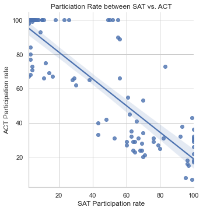


```python
# sns.scatterplot(final.state, final.sat_part)
# plt.xticks( rotation= 60 )
# plt.title('SAT Participation Rete Each State');

df_final_NI = pd.read_csv('../data/final_v.csv') # 
df_final_NI.head()
df_final_NI.name ="state"
#df_final_NI.reset_index(inplace=True)`

# df_final_NI.head()
plt.figure(figsize=(15,4))
sns.scatterplot(df_final_NI.state, df_final_NI.sat_part)
plt.xticks( rotation= 90 )
plt.title('SAT Participation Rete Each State');
```


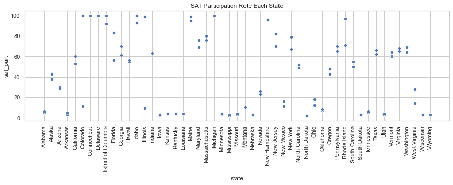


```python
df_final_NI.head()
```


<div>
<style scoped>
    .dataframe tbody tr th:only-of-type {
        vertical-align: middle;
    }

    .dataframe tbody tr th {
        vertical-align: top;
    }

    .dataframe thead th {
        text-align: right;
    }
</style>
<table border="1" class="dataframe">
  <thead>
    <tr style="text-align: right;">
      <th></th>
      <th>state</th>
      <th>act_part</th>
      <th>act_english</th>
      <th>act_math</th>
      <th>act_reading</th>
      <th>act_science</th>
      <th>act_composite</th>
      <th>sat_part</th>
      <th>sat_ebrw</th>
      <th>sat_math</th>
      <th>sat_total</th>
    </tr>
  </thead>
  <tbody>
    <tr>
      <th>0</th>
      <td>Alabama</td>
      <td>100.0</td>
      <td>18.9</td>
      <td>18.4</td>
      <td>19.7</td>
      <td>19.4</td>
      <td>19.2</td>
      <td>5.0</td>
      <td>593.0</td>
      <td>572.0</td>
      <td>1165.0</td>
    </tr>
    <tr>
      <th>1</th>
      <td>Alaska</td>
      <td>65.0</td>
      <td>18.7</td>
      <td>19.8</td>
      <td>20.4</td>
      <td>19.9</td>
      <td>19.8</td>
      <td>38.0</td>
      <td>547.0</td>
      <td>533.0</td>
      <td>1080.0</td>
    </tr>
    <tr>
      <th>2</th>
      <td>Arizona</td>
      <td>62.0</td>
      <td>18.6</td>
      <td>19.8</td>
      <td>20.1</td>
      <td>19.8</td>
      <td>19.7</td>
      <td>30.0</td>
      <td>563.0</td>
      <td>553.0</td>
      <td>1116.0</td>
    </tr>
    <tr>
      <th>3</th>
      <td>Arkansas</td>
      <td>100.0</td>
      <td>18.9</td>
      <td>19.0</td>
      <td>19.7</td>
      <td>19.5</td>
      <td>19.4</td>
      <td>3.0</td>
      <td>614.0</td>
      <td>594.0</td>
      <td>1208.0</td>
    </tr>
    <tr>
      <th>4</th>
      <td>California</td>
      <td>31.0</td>
      <td>22.5</td>
      <td>22.7</td>
      <td>23.1</td>
      <td>22.2</td>
      <td>22.8</td>
      <td>53.0</td>
      <td>531.0</td>
      <td>524.0</td>
      <td>1055.0</td>
    </tr>
  </tbody>
</table>
</div>


```python
# final['sat_part_18'] # Alabama 6, Alaska 43
final['sat_part_17'] # Alabama 6, Alaska 43
```


    state
    Alabama                   5.0
    Alaska                   38.0
    Arizona                  30.0
    Arkansas                  3.0
    California               53.0
    Colorado                 11.0
    Connecticut             100.0
    Delaware                100.0
    District of Columbia    100.0
    Florida                  83.0
    Georgia                  61.0
    Hawaii                   55.0
    Idaho                    93.0
    Illinois                  9.0
    Indiana                  63.0
    Iowa                      2.0
    Kansas                    4.0
    Kentucky                  4.0
    Louisiana                 4.0
    Maine                    95.0
    Maryland                 69.0
    Massachusetts            76.0
    Michigan                100.0
    Minnesota                 3.0
    Mississippi               2.0
    Missouri                  3.0
    Montana                  10.0
    Nebraska                  3.0
    Nevada                   26.0
    New Hampshire            96.0
    New Jersey               70.0
    New Mexico               11.0
    New York                 67.0
    North Carolina           49.0
    North Dakota              2.0
    Ohio                     12.0
    Oklahoma                  7.0
    Oregon                   43.0
    Pennsylvania             65.0
    Rhode Island             71.0
    South Carolina           50.0
    South Dakota              3.0
    Tennessee                 5.0
    Texas                    62.0
    Utah                      3.0
    Vermont                  60.0
    Virginia                 65.0
    Washington               64.0
    West Virginia            14.0
    Wisconsin                 3.0
    Wyoming                   3.0
    Name: sat_part_17, dtype: float64


```python
final.head()
Different = final['sat_part_18']-final['sat_part_17']
```

#### (Optional): Using Tableau, create a choropleth map for each variable using a map of the US. 

Save this plot as an image file in an images directory, provide a relative path, and insert the image into notebook in markdown.

## Descriptive and Inferential Statistics

#### Summarizing Distributions

Above, we used pandas `describe` to provide quick summary statistics of our numeric columns. We also demonstrated many visual relationships.

As data scientists, having a complete understanding of data is imperative prior to modeling.

While we will continue to build our analytic tools, we know that measures of *central tendency*, *spread*, and *shape/skewness* provide a quick summary of distributions.

For each variable in your data, summarize the underlying distributions (in words & statistics)
 - Be thorough in your verbal description of these distributions.
 - Be sure to back up these summaries with statistics.


```python
round(final_v.describe(),1)
```


<div>
<style scoped>
    .dataframe tbody tr th:only-of-type {
        vertical-align: middle;
    }

    .dataframe tbody tr th {
        vertical-align: top;
    }

    .dataframe thead th {
        text-align: right;
    }
</style>
<table border="1" class="dataframe">
  <thead>
    <tr style="text-align: right;">
      <th></th>
      <th>act_part</th>
      <th>act_english</th>
      <th>act_math</th>
      <th>act_reading</th>
      <th>act_science</th>
      <th>act_composite</th>
      <th>sat_part</th>
      <th>sat_ebrw</th>
      <th>sat_math</th>
      <th>sat_total</th>
    </tr>
  </thead>
  <tbody>
    <tr>
      <th>count</th>
      <td>102.0</td>
      <td>102.0</td>
      <td>102.0</td>
      <td>102.0</td>
      <td>102.0</td>
      <td>102.0</td>
      <td>102.0</td>
      <td>102.0</td>
      <td>102.0</td>
      <td>102.0</td>
    </tr>
    <tr>
      <th>mean</th>
      <td>63.5</td>
      <td>21.0</td>
      <td>21.2</td>
      <td>22.0</td>
      <td>21.2</td>
      <td>21.5</td>
      <td>42.8</td>
      <td>566.4</td>
      <td>551.9</td>
      <td>1123.1</td>
    </tr>
    <tr>
      <th>std</th>
      <td>33.0</td>
      <td>2.4</td>
      <td>2.0</td>
      <td>2.1</td>
      <td>2.6</td>
      <td>2.1</td>
      <td>36.3</td>
      <td>46.4</td>
      <td>68.7</td>
      <td>92.9</td>
    </tr>
    <tr>
      <th>min</th>
      <td>7.0</td>
      <td>16.3</td>
      <td>17.8</td>
      <td>18.0</td>
      <td>2.3</td>
      <td>17.7</td>
      <td>2.0</td>
      <td>480.0</td>
      <td>52.0</td>
      <td>950.0</td>
    </tr>
    <tr>
      <th>25%</th>
      <td>31.0</td>
      <td>19.0</td>
      <td>19.4</td>
      <td>20.4</td>
      <td>19.9</td>
      <td>19.8</td>
      <td>4.0</td>
      <td>534.2</td>
      <td>522.2</td>
      <td>1055.2</td>
    </tr>
    <tr>
      <th>50%</th>
      <td>66.5</td>
      <td>20.5</td>
      <td>20.9</td>
      <td>21.6</td>
      <td>21.2</td>
      <td>21.4</td>
      <td>45.5</td>
      <td>554.5</td>
      <td>545.5</td>
      <td>1099.0</td>
    </tr>
    <tr>
      <th>75%</th>
      <td>100.0</td>
      <td>23.4</td>
      <td>23.1</td>
      <td>24.2</td>
      <td>23.1</td>
      <td>23.6</td>
      <td>70.0</td>
      <td>613.5</td>
      <td>595.0</td>
      <td>1209.5</td>
    </tr>
    <tr>
      <th>max</th>
      <td>100.0</td>
      <td>26.0</td>
      <td>25.3</td>
      <td>26.1</td>
      <td>24.9</td>
      <td>25.6</td>
      <td>100.0</td>
      <td>644.0</td>
      <td>655.0</td>
      <td>1298.0</td>
    </tr>
  </tbody>
</table>
</div>


Answers:


#### Distributions in the data

In this dataset, each data represents a sample from a population.                        
For example, for ACT math test:
- Population: the test results of all the students who take this test, nation-wide.
- Population mean: is the national average of ACT math test (total scores/total no. of test takers) 
- Sample: the state means of ACT math test. We have 51 samples (51 states)

***According to CLT, we generally assuming that data we sample from a population will be normally distributed. Do we observe this trend?***

Answer:

Does This Assumption Hold for:
    - Math
    - Reading
    - Rates
Explain your answers for each distribution and how you think this will affect estimates made from these data.


```python
sns.set(style="darkgrid", palette="coolwarm_r", color_codes=True)
fig, axes = plt.subplots(2, 3, sharex=True, figsize=(30,10))
fig.suptitle('ACT sample distribution', fontsize=50)
plot1 = (final_v['act_math']/32)*100
plot2 = (final_v['act_reading']/32)*100
plot3 = final_v['act_part']
plot4 = (final_v['sat_math']/800)*100
plot5 = (final_v['sat_ebrw']/800)*100
plot6 = final_v['sat_part']
sns.distplot(plot1, kde=True, color="g", ax=axes[0,0])
sns.distplot(plot2, kde=True, color="g", ax=axes[0,1])
sns.distplot(plot3, kde=True, color="g", ax=axes[0,2])
sns.distplot(plot4, kde=True, color="g", ax=axes[1,0])
sns.distplot(plot5, kde=True, color="g", ax=axes[1,1])
sns.distplot(plot6, kde=True, color="g", ax=axes[1,2])
fz = 30
axes[0,0].set_title('ACT 17/18 Math Score Distribution in %', fontsize=fz)
axes[0,1].set_title('ACT 17/18 Reading Score Distribution in %', fontsize=fz)
axes[0,2].set_title('ACT 17/18 Participation Distribution in %', fontsize=fz)
axes[1,0].set_title('SAT 17/18 Math Score Distribution in %', fontsize=fz)
axes[1,1].set_title('SAT 17/18 Reading Score Distribution in %', fontsize=fz)
axes[1,2].set_title('SAT 17/18 Participation Distribution in %', fontsize=fz)
```


    Text(0.5, 1.0, 'SAT 17/18 Participation Distribution in %')


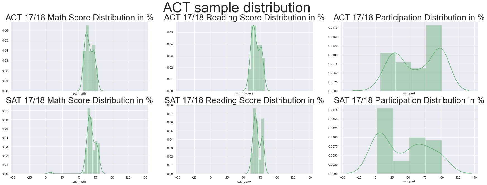


<span style='color:green'>**Answer:** </span>
<span style='color:green'>From the graph observed for 102 samples each for two years, the distribution shown quite normally distributed except participation. For scores related, if we are able to construct using all scores instaed of mean of each state, a more "normal distributed" pattern should be observed. Similary for the participation, if we are able to obtain a smaller zone instead of at state level, a normal distributed pattern should be obtained. Bigger pool of samples will be the key on obtaining the normally distributed pattern.</span>

#### Estimate Limits of Data

Suppose we only seek to understand the relationship between SAT and ACT participation rates in 2017. 

##### Does it make sense to conduct statistical inference given these data specifically? 

Why or why not?

<span style='color:green'>**Answer:** </span>
- <span style='color:green'>Yes, since we only have a sample of two years, we should be able to perform the statistical inferencing. </span>
- <span style='color:green'>There are some convolution on the data as people who took both SAT and ACT test. </span>

*(think about granularity, aggregation, the relationships between populations size & rates...consider the actually populations these data describe in answering this question)*

##### Is it appropriate to compare *these* specific SAT and ACT math scores  - can we say students with higher SAT math score is better than those with lower ACT math score, or vice versa?

Why or why not? 

<span style='color:green'> **Answer:** </span>
<span style='color:green'> In principle, both SAT and ACT should provide a similar assessment on the competency, therefore, there should be no different between SAT or ACT math score assesment. </span> 
<span style='color:green'>Theoritically, both SAT and ACT generally cover the same topics, both ACT and SAT scores are used for college admissions decisions and awarding merit-based scholarships.</span> <span style='color:green'>The null hypothesis is the "status quo" hypothesis that you wish to prove wrong. We typically denote the null hypothesis with  𝐻0 .</span>

<span style='color:green'> However, we can perform a hypothesis test the subject Math to evaluate this.</span>

> <span style='color:green'> $H_0:$ There is NO difference in evaluating college student competency using both test</span>

> <span style='color:green'> $H_A:$ There is difference in evaluating college student competency using both test</span>

<span style='color:green'>**First group of tests, is to ensure there is no different within SAT or ACT**</span>
- <span style='color:green'> Test 1.1 :No different ACT 17 vs ACT 18 </span>
- <span style='color:green'> Test 1.2 :No different SAT 17 vs SAT 18 </span>


<span style='color:green'>**Second group of test, is to ensure there is no different between SAT or ACT**</span>
- <span style='color:green'> Test 2.1 :No different ACT 17 vs SAT 17 </span>
- <span style='color:green'> Test 2.2 :No different ACT 18 vs SAT 18 </span>
- <span style='color:green'> Test 2.3 :No different ACT 17 vs SAT 18 </span>
- <span style='color:green'> Test 2.4 :No different ACT 17/18 vs SAT 17/18 </span>

<span style='color:green'>**Group 1 Tests** </span>


```python
Score_A = (final['act_math_17'])
Score_B = (final['act_math_18'])
t_stat, p_value = stats.ttest_ind(Score_A, Score_B, equal_var=False)
print("ACT 17 vs ACT 18 Math P-Value is {}%".format(round(p_value*100,2)))

Score_A = (final['sat_math_17'])
Score_B = (final['sat_math_18'])
t_stat, p_value = stats.ttest_ind(Score_A, Score_B, equal_var=False)
print("SAT 17 vs SAT 18 Math P-Value is {}%".format(round(p_value*100,2)))
```

    ACT 17 vs ACT 18 Math P-Value is 88.66%
    SAT 17 vs SAT 18 Math P-Value is 52.99%


<span style='color:green'>From the above, we can observed that there is no significant within the similar tests</span>

<span style='color:green'>**Group 2 Tests** </span>


```python
Score_A = (final['act_math_17']/32)*100
Score_B = (final['sat_math_17']/800)*100
t_stat, p_value = stats.ttest_ind(Score_A, Score_B, equal_var=False)
print("ACT 17 vs SAT 17 Math P-Value is {}%".format(round(p_value*100,4)))
Score_A = (final['act_math_18']/32)*100
Score_B = (final['sat_math_18']/800)*100
t_stat, p_value = stats.ttest_ind(Score_A, Score_B, equal_var=False)
print("ACT 18 vs SAT 18 Math P-Value is {}%".format(round(p_value*100,4)))
Score_A = (final['act_math_17']/32)*100
Score_B = (final['sat_math_18']/800)*100
t_stat, p_value = stats.ttest_ind(Score_A, Score_B, equal_var=False)
print("ACT 17 vs SAT 18 Math P-Value is {}%".format(round(p_value*100,4)))
Score_A = (final_v['act_math']/32)*100
Score_B = (final_v['sat_math']/800)*100
t_stat, p_value = stats.ttest_ind(Score_A, Score_B, equal_var=False)
print("ACT 17/18 vs SAT 18/18 Math P-Value is {}%".format(round(p_value*100,4)))
```

    ACT 17 vs SAT 17 Math P-Value is 19.3064%
    ACT 18 vs SAT 18 Math P-Value is 0.4945%
    ACT 17 vs SAT 18 Math P-Value is 0.6726%
    ACT 17/18 vs SAT 18/18 Math P-Value is 0.666%


<span style='color:green'> **Answer:** </span>
<span style='color:green'> From the above tests, it suggest that there is a different between ACT and SAT after the introduction of SAT 18 into the scenario </span>

#### Statistical Evaluation of Distributions 

**If you feel it's appropriate**, using methods we discussed in class, run hypothesis tests to compare variables of interest in our dataset. 

## Outside Research

Based upon your observations, choose **three** states that demonstrate interesting trends in their SAT and/or ACT participation rates. Spend some time doing outside research on state policies that might influence these rates, and summarize your findings below. **Feel free to go back and create new plots that highlight these states of interest**. If you bring in any outside tables or charts, make sure you are explicit about having borrowed them. If you quote any text, make sure that it renders as being quoted. (Make sure that you cite your sources -- check with you local instructor for citation preferences).

- [Ref1: SAT / ACT Prep Online Guides and Tips](https://blog.prepscholar.com/average-sat-scores-by-state-most-recent)
- [Ref2: SAT reclaims title of most widely used college admission test](https://www.washingtonpost.com/education/2018/10/23/sat-reclaims-title-most-widely-used-college-admission-test/)
- [Ref3: Correlation between higher SAT scores and lower average student debt](https://www.nitrocollege.com/research/student-debt-future-earnings)
- [Ref4: Student Debt and future earning](https://www.nitrocollege.com/research/student-debt-future-earnings)

<span style='color:green'> **Answer:** </span>
<span style='color:green'> According to the web as shown in above the link, there are multiple research on providing different view on SAT and ACT. The data show a correlation between higher SAT scores and lower average student debt{Ref 4}. More time will be needed to perform data collection and cleaning in order to perform the necessary analysis. </span>


```python
ACT_SAT = final[['act_part_17','act_part_18', 'sat_part_17','sat_part_18',
                 'act_composite_17','act_composite_18','sat_total_17','sat_total_18']
               ].sort_values(by = ['act_part_17'], ascending=True)
ACT_SAT.reset_index(inplace=True)
ACT_SAT['act_part_delta'] = ACT_SAT['act_part_18'] - ACT_SAT['act_part_17']
ACT_SAT['sat_part_delta'] = ACT_SAT['sat_part_18'] - ACT_SAT['sat_part_17']
ACT_SAT['act_composite_17'] = round((ACT_SAT['act_composite_17']/32)*100,2)
ACT_SAT['act_composite_18'] = round((ACT_SAT['act_composite_18']/32)*100,2)
ACT_SAT['sat_total_17'] = round((ACT_SAT['sat_total_17']/1600)*100,2)
ACT_SAT['sat_total_18'] = round((ACT_SAT['sat_total_18']/1600)*100,2)
ACT_SAT['act_composite_delta'] = ACT_SAT['act_composite_18'] - ACT_SAT['act_composite_17']
ACT_SAT['sat_total_delta'] = ACT_SAT['sat_total_18'] - ACT_SAT['sat_total_17']
ACT_SAT[['act_part_delta','sat_part_delta','act_composite_delta','sat_total_delta']]

plt.figure(figsize=(8,10))
plt.style.use('seaborn-bright')

y11 = ACT_SAT['state']
x11 = ACT_SAT['act_part_delta']
plt.plot(x11, y11, label = "ACT Participation differences between 2018/2017 ",linestyle='-', color='b',lw=1.5)
y12 = ACT_SAT['state']
x12 = ACT_SAT['act_composite_delta']
plt.plot(x12, y12, label = "ACT Composite differences between 2018/2017 ", linestyle='--',color='b',lw=1)


y21 = ACT_SAT['state']
x21 = ACT_SAT['sat_part_delta']
plt.plot(x21, y21, label = "SAT Participation differences between 2018/2017",linestyle='-',color='g',lw=1.5)
y22 = ACT_SAT['state']
x22 = ACT_SAT['sat_total_delta']
plt.plot(x22, y22, label = "SAT Total differences between 2018/2017 ", linestyle='--',color='g',lw=1)

plt.title('ACT vs SAT 2017/2018 Participation vs Composite/Total Score', fontsize=20)
# plt.axvline(25, linestyle='--', lw = 1, color="r", label= "25%")
# plt.axvline(75, linestyle='--', lw = 1, color="r", label= "75%")
# plt.axvline(50, linestyle='-', lw = 1, color="r", label= "50%")
plt.legend(loc='upper left',prop={'size': 7})
plt.rc('xtick',labelsize=9)
plt.rc('ytick',labelsize=9)
plt.show()

```


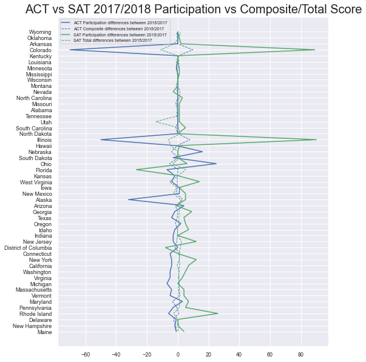


<span style='color:green'> **Answer:** </span>
<span style='color:green'> From the above diagram, it seems like SAT is gaining more participation than ACT. Furthermore, the results and participation on both ACT and SAT is inversely related to each other. We could also observed few states with swing of participation corresponding with the relevant score swing as well (Illinois, Colorado...etc.)</span>


```python
ACT_LowestParticipation = final[['act_part_17','act_part_18','act_math_17',
                                 'act_math_18','act_reading_17','act_reading_18',
                                 'act_composite_17','act_composite_18']
                               ].sort_values(by = ['act_part_17','act_part_18'], ascending=True)
ACT_LowestParticipation.reset_index(inplace=True)
ACT_LowestParticipation['act_composite_17'] = round((ACT_LowestParticipation['act_composite_17']/32)*100,2)
ACT_LowestParticipation['act_composite_18'] = round((ACT_LowestParticipation['act_composite_18']/32)*100,2)
ACT_LowestParticipation['act_math_17'] = round((ACT_LowestParticipation['act_math_17']/32)*100,2)
ACT_LowestParticipation['act_math_18'] = round((ACT_LowestParticipation['act_math_18']/32)*100,2)
ACT_LowestParticipation['act_reading_17'] = round((ACT_LowestParticipation['act_reading_17']/32)*100,2)
ACT_LowestParticipation['act_reading_18'] = round((ACT_LowestParticipation['act_reading_18']/32)*100,2)
```


```python
SAT_LowestParticipation = final[['sat_part_17','sat_ebrw_17','sat_math_17',
                                 'sat_total_17','sat_part_18','sat_ebrw_18',
                                 'sat_math_18','sat_total_18']
                               ].sort_values(by = ['sat_part_17','sat_part_18'], ascending=True)
SAT_LowestParticipation.reset_index(inplace=True)
SAT_LowestParticipation['sat_total_17'] = round((SAT_LowestParticipation['sat_total_17']/1600)*100,2)
SAT_LowestParticipation['sat_total_18'] = round((SAT_LowestParticipation['sat_total_18']/1600)*100,2)
SAT_LowestParticipation['sat_ebrw_17'] = round((SAT_LowestParticipation['sat_ebrw_17']/800)*100,2)
SAT_LowestParticipation['sat_ebrw_18'] = round((SAT_LowestParticipation['sat_ebrw_18']/800)*100,2)
SAT_LowestParticipation['sat_math_17'] = round((SAT_LowestParticipation['sat_math_17']/800)*100,2)
SAT_LowestParticipation['sat_math_18'] = round((SAT_LowestParticipation['sat_math_17']/800)*100,2)
```


```python
y1 = ACT_LowestParticipation['state']
x1 = ACT_LowestParticipation['act_part_17']
plt.figure(figsize=(8,10))
# plt.xticks( rotation= 90 )
plt.style.use('seaborn-bright')
plt.plot(x1, y1, label = "ACT2017 Participation", color='b',lw=2)

y11 = ACT_LowestParticipation['state']
x11 = ACT_LowestParticipation['act_composite_17']
plt.plot(x11, y11, label = "ACT2017 Score", color='g',lw=2)
plt.title('ACT 17 Score and Participation in%', fontsize=20)
plt.axvline(25, linestyle='--', lw = 1, color="r", label= "25%")
plt.axvline(75, linestyle='--', lw = 1, color="r", label= "75%")
plt.axvline(50, linestyle='-', lw = 1, color="r", label= "50%")
plt.legend(loc='upper left',prop={'size': 7})
plt.rc('xtick',labelsize=7)
plt.rc('ytick',labelsize=7)
plt.show()
```


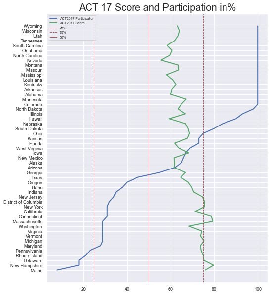


```python
ACT_LowestParticipation = final[['act_part_18','act_composite_18']
                               ].sort_values(by = ['act_part_18'], ascending=True)
ACT_LowestParticipation.reset_index(inplace=True)
ACT_LowestParticipation['act_composite_18'] = round((ACT_LowestParticipation['act_composite_18']/32)*100,2)

y1 = ACT_LowestParticipation['state']
x1 = ACT_LowestParticipation['act_part_18']
plt.figure(figsize=(8,10))
# plt.xticks( rotation= 90 )
plt.style.use('seaborn-bright')
plt.plot(x1, y1, label = "ACT2018 Participation", color='b',lw=2)

y11 = ACT_LowestParticipation['state']
x11 = ACT_LowestParticipation['act_composite_18']
plt.plot(x11, y11, label = "ACT2018 Score", color='g',lw=2)
plt.title('ACT 18 Score and Participation in%', fontsize=20)
plt.axvline(25, linestyle='--', lw = 1, color="r", label= "25%")
plt.axvline(75, linestyle='--', lw = 1, color="r", label= "75%")
plt.axvline(50, linestyle='-', lw = 1, color="r", label= "50%")
plt.legend(loc='upper left',prop={'size': 7})
plt.rc('xtick',labelsize=7)
plt.rc('ytick',labelsize=7)
plt.show()
```


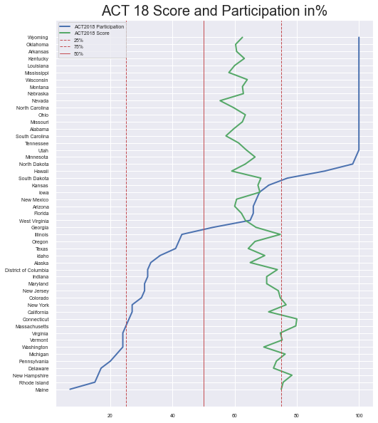


```python
plt.figure(figsize=(8,10))
y2 = SAT_LowestParticipation['state']
x2 = SAT_LowestParticipation['sat_part_17']
plt.plot(x2, y2, label = "SAT2017 Participation", color='b',lw=2)

y21 = SAT_LowestParticipation['state']
x21 = SAT_LowestParticipation['sat_total_17']
plt.plot(x21, y21, label = "SAT2017 Score", color='g',lw=2)
plt.title('SAT 17 Score and Participation in%', fontsize=20)
plt.axvline(25, linestyle='--', lw = 1, color="r", label= "25%")
plt.axvline(50, linestyle='-', lw = 1, color="r", label= "50%")
plt.axvline(75, linestyle='--', lw = 1, color="r", label= "75%")
plt.legend(loc='upper left',prop={'size': 10})
plt.rc('xtick',labelsize=9)
plt.rc('ytick',labelsize=9)
plt.show()
```


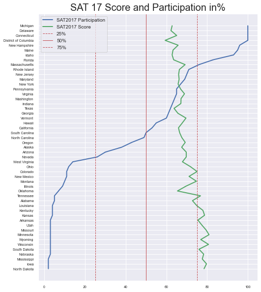


```python
SAT_LowestParticipation = final[['sat_part_18','sat_total_18']
                               ].sort_values(by = ['sat_part_18'], ascending=True)
SAT_LowestParticipation.reset_index(inplace=True)
SAT_LowestParticipation['sat_total_18'] = round((SAT_LowestParticipation['sat_total_18']/1600)*100,2)

plt.figure(figsize=(8,10))
y2 = SAT_LowestParticipation['state']
x2 = SAT_LowestParticipation['sat_part_18']
plt.plot(x2, y2, label = "SAT2018 Participation", color='b',lw=2)

y21 = SAT_LowestParticipation['state']
x21 = SAT_LowestParticipation['sat_total_18']
plt.plot(x21, y21, label = "SAT2018 Score", color='g',lw=2)
plt.title('SAT 18 Score and Participation in%', fontsize=20)
plt.axvline(25, linestyle='--', lw = 1, color="r", label= "25%")
plt.axvline(50, linestyle='-', lw = 1, color="r", label= "50%")
plt.axvline(75, linestyle='--', lw = 1, color="r", label= "75%")
plt.legend(loc='upper left',prop={'size': 10})
plt.rc('xtick',labelsize=9)
plt.rc('ytick',labelsize=9)
plt.show()
```


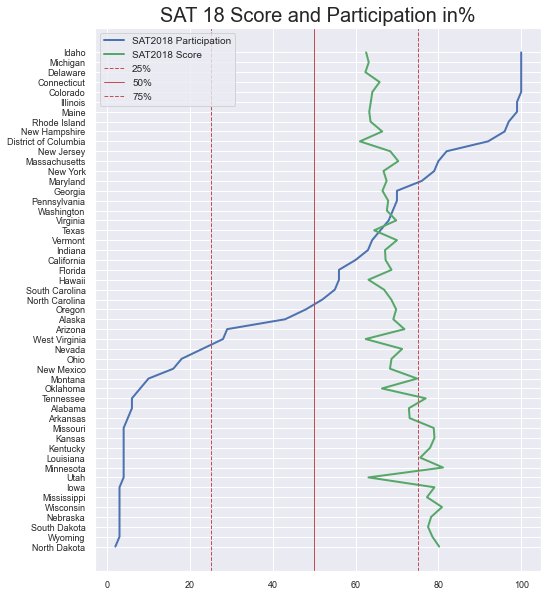


## Conclusions and Recommendations

Based on your exploration of the data, what are you key takeaways and recommendations? Choose one state with a lower participation rate and provide a suggestion for how the College Board might increase participation amongst graduating seniors in this state. Are there additional data you desire that would better inform your investigations?

<span style='color:green'>**Key Take away**</span>
<span style='color:green'>Preliminary analysis can conclude the following:</span>
><span style='color:green'>The ACT and SAT participation seems like inversely correlated with each others, with states that to profer one test than other. ACT seems like is having more 100 % committed states than SAT, this suggestted that ACT is much more popular than SAT.</span>

><span style='color:green'> With reference to the last few diagram, ACT and SAT scores are inversely correlated with their participation rates. Those state with lower participation tend to achieving higher score and vice versa. 

><span style='color:green'>The hypothesis test on SAT & ACT also suggested both tests are different. The tests suggest that there is a different between ACT and SAT after the introduction of SAT 18 into the scenario </span>
    
><span style='color:green'>More data sets will need to be introduced in oder to have a more comprehensive and in depth conclusion on both SAT and ACT. Theses data sets should include (but not limited) race, gendar, school acceptance level (in quantity) on both ACT and SAT. </span>

